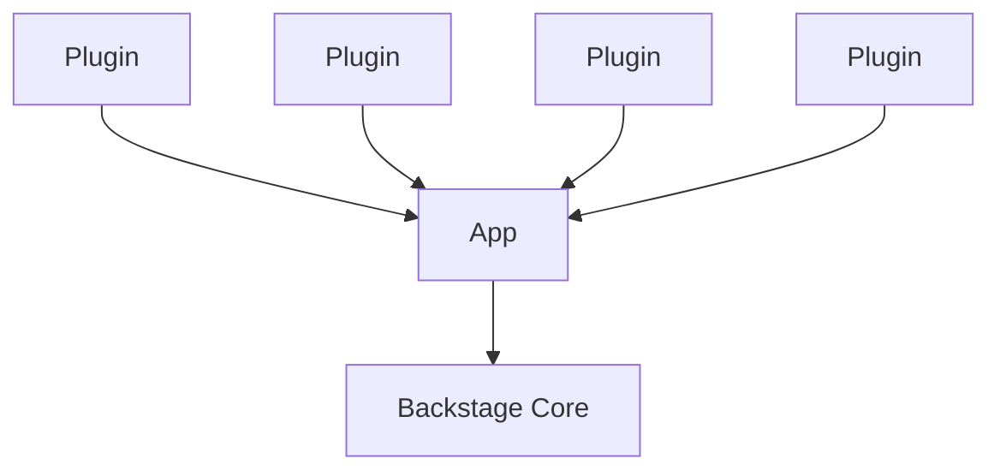

### Introduction to Developer Portals  
#### Overview
Organizations want to improve their software and infrastructure’s discoverability so that their developers’ can benefit from  
accessing and using the organization’s resources. Developer Portals play a central role in enabling automated discoverability  
and providing self-service resources that make autonomy possible at scale.  

#### Discoverability: It Only Works If It’s Automated
Discoverability is defined by how rapidly you can find information about a service, library, tool, team, or repository. In a world where  
dozens—or hundreds—of development teams contribute to several codebases, use tens of development tools, and ship their services daily,  
it is almost impossible to know what you’re looking for in the first place. Given that Cloud native teams wrangle with different stacks and contexts,  
they must come up with a way of communicating with others about what they’re doing and how, as well as learn from other teams. Usually,  
these ways are manual compilations of resources that get pieced together in a document by somebody. The problem is not writing that document but  
keeping it up to date and getting everybody to know it exists.  

Discoverability is hard to achieve unless there’s a unified and reliable way to explore what is available in the organization.  
Providing automated Discoverability has become a significant enabler for improved collaboration at the organizations investing in developing an Inner Source culture.  

#### What Is a Developer Portal?
A Developer Portal is a go-to place for developers when they need to learn about their ecosystem and contribute to it.  
it allows teams to keep working independently, choosing their preferred tools, and deploying daily, but exposes their work so everyone can explore and benefit  
from their microservices, APIs, libraries, websites, pipelines, and algorithms. A Developer Portal serves three purposes: helps developers navigate their ecosystem,  
empowers engineers with self-service capabilities, and provides leaders and teams with insight into the tech’s health and maturity.  

Discoverability in a Developer Portal is automated and centralized into a software catalog. The Developer Portal aggregates information about each component,  
including which team is responsible for it, documentation, availability, deployments, Snyk issues, PagerDuty incidents, and any other information that might be useful to your team.  

Indeed, an often sought-after feature of Developer Portals is their ability to track ownership and interdependencies across services. Each software component  
has a team or individual contributor who owns it and is responsible for it. Additionally, the software catalog graphs the dependencies between the components.  

### Backstage
#### Backstage’s Philosophy
Backstage’s vision is to create the best Developer Experience possible. At the same time it is not intended to be a single source of truth,  
but an aggregator. Backstage doesn’t seek to replace your existing CI/CD manager or LDAP directory, nor to re-implement their UIs. Instead,  
Backstage processes information about your services from different sources and puts them together, so it’s easier for developers to navigate them.  
For Backstage to be effective, it requires every software component to be owned by a single team, who will be responsible for keeping its information up to date.  
And we’ve naturally arrived at the other Backstage pillar: ownership.

#### Backstage Is a Framework
Backstage is not a finished product that you can install and use. Rather, Backstage is a collection of tools and libraries that can be used to  
create your own Developer Portal. Backstage’s core is composed of around 25 packages, which include a CLI, utility tools, API definitions, themes,  
and helpers. But what really makes up Backstage are the more than 150 open source plugin packages available, which include the framework’s main features.  
You can pick and choose what you need and extend its functionality by creating new plugins too.  

But don’t worry, you don’t have to learn what all those packages are to get started. Backstage provides you with a starting point through their CLI,  
and from there, you can add or remove plugins as you please.  

#### Your Backstage Instance
In a nutshell, your Backstage instance is a Node/React app built using Backstage’s core libraries on top of which you install community and private plugins.  
Backstage uses a three-layers model to explain how a Developer Portal is built using its framework.  

Backstage's Three layer Model

* Core: This is what the Backstage team maintains and releases as open source. Unless you want to contribute to the project, 
      you may not need to wrap your head around this piece from the beginning.
* App: This app is the Developer Portal that you’ll make available to your developers. While adopting Backstage, you’ll be interacting the most with this piece.
* Plugins: To extend your instance’s functionality, you can install plugins into it. Even basic functionality is abstracted as plugins, including the Catalog. 
           So you’ll always be working with a handful of plugins. There are a few dozen community plugins available to integrate popular services. And you can create your own.

#### Backstage Features
Backstage offers five core functionalities: a software catalog, software templates, a documentation generator, a Kubernetes cluster visualizer,  
and cross-ecosystem search capabilities. Before diving into the most important ones in the following chapters, we’ll overview what each of these  
features does and how they interact.  

##### Introducing the Software Catalog
Backstage’s Software Catalog is the framework’s most demanded feature and the cornerstone for everything else. The Catalog’s objective is to map all  
software assets in your organization, including websites, APIs, libraries, and resources, in a centralized directory. This centralization is aimed  
at helping teams manage technology and enable discoverability.  

The Catalog is flexible enough to host a wide variety of software assets, known as entities in Backstage. Entities can be differentiated by kind.  
Moreover, even within kinds of entities, you can define types.  

The Catalog is powered by metadata stored in YAML files, which describe the kind, type, name, owner, and more details of a single entity per file.  
These files are commonly stored along their respective codebase, such that it gets updated frequently.  

Tracking ownership and dependencies is one of the strongest use cases for the Catalog. These are also declared in the YAML file describing a  
software component. Only a single team can be the component owner, and this team must be registered in the Catalog as an entity as well.  
As for dependencies, Backstage lets you define how the component depends on another entity and what it exposes so others can consume it.  

##### Introducing the Scaffolder
One major use case for Backstage is helping onboard new team members and promoting golden paths among regular contributors.  
The Scaffolder provides your developers with the ability to execute software templates that initialize repositories with skeleton code and predefined settings.  

A software template is defined in a YAML file that specifies parameters and steps to execute. Backstage will generate a UI in the Scaffolder  
based on the parameters that you specify in your software template. For the steps, you can leverage built-in actions for common fetch operations,  
but you can also define your own.  

Templates are stored in the Catalog under a template kind. Furthermore, all components initialized by the Scaffolder are automatically added to the Catalog.  
Therefore, there’s a virtuous cycle between the Scaffolder and the Catalog that promotes discoverability and standardization.  

##### Introducing TechDocs
A major win for teams using Backstage is that they get a centralized hub for all their documentation. TechDocs is the framework’s   
documentation-as-code solution; it takes markdown files and transforms them into static pages.  

TechDocs follows the same principle as the Catalog metadata files: stay close to the source code to stay accurate.  
TechDocs are written as markdown files in the repository where the entity that they document is kept. Then, the TechDocs  
Backstage plugin fetches these files from all services, generates static pages, and publishes them.  

##### Introducing Kubernetes
Backstage ships with a plugin that helps developers visualize the state of the clusters for each service. The tool helps understand  
the health of the service’s clusters at a glance, including development, staging, and production environments.  

The Kubernetes plugin is tied to the Catalog. It shows information about the clusters associated with a service registered in the catalog.  
To enable it, you must tell Backstage how to discover your clusters, whether that is by reading information that exists already in the  
Catalog or by fetching it directly from GKE or another custom Kubernetes cluster supplier.  

##### Introducing Search
Search allows developers to find information across their ecosystem by leveraging your search engine of preference and lets  
you customize how things are indexed and presented to the user. 

Search is quite customizable. For starters, the plugin allows you to bring your own search engine, although ElasticSearch is the officially  
maintained engine. Search ships with a rudimentary query translator that turns the user’s input into a fully formed query, but you’re allowed  
to customize it to your engine and use cases better. You’re also welcome to customize the search results page and what each result looks like.  

Under the hood, Search searches “documents” that represent entities, documentation pages, or any other thing that you put into Backstage.  
These documents are consumed through streams exposed by a Collator. Collators define what can be found by defining, indexing, and collecting  
documents. Currently, collators are available for the Catalog, TechDocs, and Stack Overflow. You can define your collators too.  

##### Adaptability Through Plugins
So far, all the features we’ve seen are implemented as plugins but are maintained by the Backstage team and considered core features of the framework.  
But a few dozen community plugins are available, and even plugins that extend other plugins.  

Community plugins either extend a core feature, add new functionalities, or integrate with a vendor. There’s a handful of plugins that extend  
the Catalog, for instance, a plugin that generates graphs that show the relationship between entities or an Okta plugin that ingests users and teams as entities.  

Additionally, you can write your own plugins for internal use or contribute them back to the community.  

##### Technology Stack
To work on your Backstage instance, you’ll be working with a lot of YAML, as YAML files are the primary source of metadata.  
For a basic setup, you’ll find it handy to have some knowledge of React to update your instance’s UI to include plugins.  
If you need custom processors or plugins, you’ll need a good understanding of Node, as it’s what powers Backstage’s backend.  
TypeScript is favored across the project.  

##### Self-hosted Backstage
The disadvantage of self-hosted Backstage is that your team will need to spend considerable effort learning about Backstage’s internals,  
upgrading the core libraries monthly, and each plugin when there’s a new release. Managing your instance can represent a part-time engineer  
or more, depending on the scale of your Developer Portal.  

Though later you can offer Backstage as part of your platform solution.

### Setting up local Backstage
#### Prerequisites
These instructions are targeting Linux-based operating systems, and You’ll need to have installed:
Node Version 16 (It is recommended to use volta or nvm to manage node versions)
Yarn to manage dependencies
Git for source control

#### Creating an Instance
You’ll start by running Backstage’s create-app script through npx, a package manager utility that comes with Node:

**npx @backstage/create-app**

You’ll be prompted to input the name you want for your Backstage instance; it’ll be used to name the directory where it’ll be stored. In our case, we chose the name terroir-portal.

The script will copy Backstage’s template with directories and files and install all its dependencies.
When you navigate to the newly created directory, you’ll see the following structure:

─ packages
    ├─ app
            └─ package.json
    └─ backend
            └─ package.json
─ app-config.yaml
─ catalog-info.yaml
─ lerna.json
─ package.json

