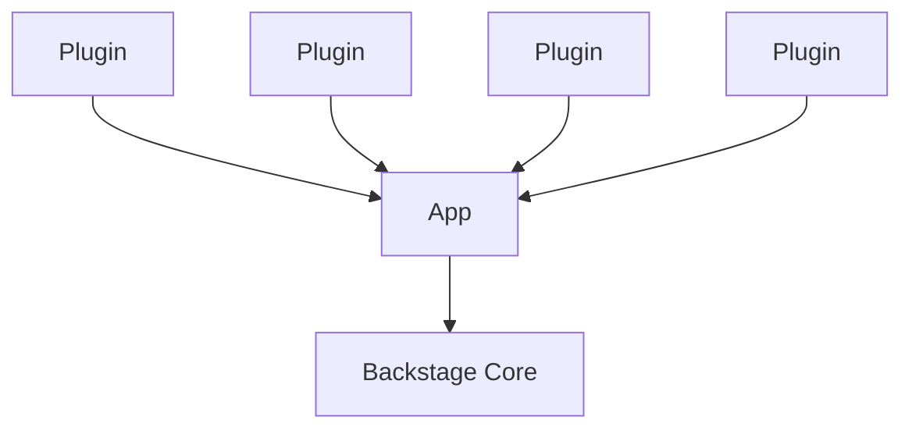

### Introduction to Developer Portals  
#### Overview
Organizations want to improve their software and infrastructure’s discoverability so that their developers’ can benefit from  
accessing and using the organization’s resources. Developer Portals play a central role in enabling automated discoverability  
and providing self-service resources that make autonomy possible at scale.  

#### Discoverability: It Only Works If It’s Automated
Discoverability is defined by how rapidly you can find information about a service, library, tool, team, or repository. In a world where  
dozens—or hundreds—of development teams contribute to several codebases, use tens of development tools, and ship their services daily,  
it is almost impossible to know what you’re looking for in the first place. Given that Cloud native teams wrangle with different stacks and contexts,  
they must come up with a way of communicating with others about what they’re doing and how, as well as learn from other teams. Usually,  
these ways are manual compilations of resources that get pieced together in a document by somebody. The problem is not writing that document but  
keeping it up to date and getting everybody to know it exists.  

Discoverability is hard to achieve unless there’s a unified and reliable way to explore what is available in the organization.  
Providing automated Discoverability has become a significant enabler for improved collaboration at the organizations investing in developing an Inner Source culture.  

#### What Is a Developer Portal?
A Developer Portal is a go-to place for developers when they need to learn about their ecosystem and contribute to it.  
it allows teams to keep working independently, choosing their preferred tools, and deploying daily, but exposes their work so everyone can explore and benefit  
from their microservices, APIs, libraries, websites, pipelines, and algorithms. A Developer Portal serves three purposes: helps developers navigate their ecosystem,  
empowers engineers with self-service capabilities, and provides leaders and teams with insight into the tech’s health and maturity.  

Discoverability in a Developer Portal is automated and centralized into a software catalog. The Developer Portal aggregates information about each component,  
including which team is responsible for it, documentation, availability, deployments, Snyk issues, PagerDuty incidents, and any other information that might be useful to your team.  

Indeed, an often sought-after feature of Developer Portals is their ability to track ownership and interdependencies across services. Each software component  
has a team or individual contributor who owns it and is responsible for it. Additionally, the software catalog graphs the dependencies between the components.  

### Backstage
#### Backstage’s Philosophy
Backstage’s vision is to create the best Developer Experience possible. At the same time it is not intended to be a single source of truth,  
but an aggregator. Backstage doesn’t seek to replace your existing CI/CD manager or LDAP directory, nor to re-implement their UIs. Instead,  
Backstage processes information about your services from different sources and puts them together, so it’s easier for developers to navigate them.  
For Backstage to be effective, it requires every software component to be owned by a single team, who will be responsible for keeping its information up to date.  
And we’ve naturally arrived at the other Backstage pillar: ownership.

#### Backstage Is a Framework
Backstage is not a finished product that you can install and use. Rather, Backstage is a collection of tools and libraries that can be used to  
create your own Developer Portal. Backstage’s core is composed of around 25 packages, which include a CLI, utility tools, API definitions, themes,  
and helpers. But what really makes up Backstage are the more than 150 open source plugin packages available, which include the framework’s main features.  
You can pick and choose what you need and extend its functionality by creating new plugins too.  

But don’t worry, you don’t have to learn what all those packages are to get started. Backstage provides you with a starting point through their CLI,  
and from there, you can add or remove plugins as you please.  

#### Your Backstage Instance
In a nutshell, your Backstage instance is a Node/React app built using Backstage’s core libraries on top of which you install community and private plugins.  
Backstage uses a three-layers model to explain how a Developer Portal is built using its framework.  

Backstage's Three layer Model

* Core: This is what the Backstage team maintains and releases as open source. Unless you want to contribute to the project, 
      you may not need to wrap your head around this piece from the beginning.
* App: This app is the Developer Portal that you’ll make available to your developers. While adopting Backstage, you’ll be interacting the most with this piece.
* Plugins: To extend your instance’s functionality, you can install plugins into it. Even basic functionality is abstracted as plugins, including the Catalog. 
           So you’ll always be working with a handful of plugins. There are a few dozen community plugins available to integrate popular services. And you can create your own.

#### Backstage Features
Backstage offers five core functionalities: a software catalog, software templates, a documentation generator, a Kubernetes cluster visualizer,  
and cross-ecosystem search capabilities. Before diving into the most important ones in the following chapters, we’ll overview what each of these  
features does and how they interact.  

##### Introducing the Software Catalog
Backstage’s Software Catalog is the framework’s most demanded feature and the cornerstone for everything else. The Catalog’s objective is to map all  
software assets in your organization, including websites, APIs, libraries, and resources, in a centralized directory. This centralization is aimed  
at helping teams manage technology and enable discoverability.  

The Catalog is flexible enough to host a wide variety of software assets, known as entities in Backstage. Entities can be differentiated by kind.  
Moreover, even within kinds of entities, you can define types.  

The Catalog is powered by metadata stored in YAML files, which describe the kind, type, name, owner, and more details of a single entity per file.  
These files are commonly stored along their respective codebase, such that it gets updated frequently.  

Tracking ownership and dependencies is one of the strongest use cases for the Catalog. These are also declared in the YAML file describing a  
software component. Only a single team can be the component owner, and this team must be registered in the Catalog as an entity as well.  
As for dependencies, Backstage lets you define how the component depends on another entity and what it exposes so others can consume it.  

##### Introducing the Scaffolder
One major use case for Backstage is helping onboard new team members and promoting golden paths among regular contributors.  
The Scaffolder provides your developers with the ability to execute software templates that initialize repositories with skeleton code and predefined settings.  

A software template is defined in a YAML file that specifies parameters and steps to execute. Backstage will generate a UI in the Scaffolder  
based on the parameters that you specify in your software template. For the steps, you can leverage built-in actions for common fetch operations,  
but you can also define your own.  

Templates are stored in the Catalog under a template kind. Furthermore, all components initialized by the Scaffolder are automatically added to the Catalog.  
Therefore, there’s a virtuous cycle between the Scaffolder and the Catalog that promotes discoverability and standardization.  

##### Introducing TechDocs
A major win for teams using Backstage is that they get a centralized hub for all their documentation. TechDocs is the framework’s   
documentation-as-code solution; it takes markdown files and transforms them into static pages.  

TechDocs follows the same principle as the Catalog metadata files: stay close to the source code to stay accurate.  
TechDocs are written as markdown files in the repository where the entity that they document is kept. Then, the TechDocs  
Backstage plugin fetches these files from all services, generates static pages, and publishes them.  

##### Introducing Kubernetes
Backstage ships with a plugin that helps developers visualize the state of the clusters for each service. The tool helps understand  
the health of the service’s clusters at a glance, including development, staging, and production environments.  

The Kubernetes plugin is tied to the Catalog. It shows information about the clusters associated with a service registered in the catalog.  
To enable it, you must tell Backstage how to discover your clusters, whether that is by reading information that exists already in the  
Catalog or by fetching it directly from GKE or another custom Kubernetes cluster supplier.  

##### Introducing Search
Search allows developers to find information across their ecosystem by leveraging your search engine of preference and lets  
you customize how things are indexed and presented to the user. 

Search is quite customizable. For starters, the plugin allows you to bring your own search engine, although ElasticSearch is the officially  
maintained engine. Search ships with a rudimentary query translator that turns the user’s input into a fully formed query, but you’re allowed  
to customize it to your engine and use cases better. You’re also welcome to customize the search results page and what each result looks like.  

Under the hood, Search searches “documents” that represent entities, documentation pages, or any other thing that you put into Backstage.  
These documents are consumed through streams exposed by a Collator. Collators define what can be found by defining, indexing, and collecting  
documents. Currently, collators are available for the Catalog, TechDocs, and Stack Overflow. You can define your collators too.  

##### Adaptability Through Plugins
So far, all the features we’ve seen are implemented as plugins but are maintained by the Backstage team and considered core features of the framework.  
But a few dozen community plugins are available, and even plugins that extend other plugins.  

Community plugins either extend a core feature, add new functionalities, or integrate with a vendor. There’s a handful of plugins that extend  
the Catalog, for instance, a plugin that generates graphs that show the relationship between entities or an Okta plugin that ingests users and teams as entities.  

Additionally, you can write your own plugins for internal use or contribute them back to the community.  

##### Technology Stack
To work on your Backstage instance, you’ll be working with a lot of YAML, as YAML files are the primary source of metadata.  
For a basic setup, you’ll find it handy to have some knowledge of React to update your instance’s UI to include plugins.  
If you need custom processors or plugins, you’ll need a good understanding of Node, as it’s what powers Backstage’s backend.  
TypeScript is favored across the project.  

##### Self-hosted Backstage
The disadvantage of self-hosted Backstage is that your team will need to spend considerable effort learning about Backstage’s internals,  
upgrading the core libraries monthly, and each plugin when there’s a new release. Managing your instance can represent a part-time engineer  
or more, depending on the scale of your Developer Portal.  

Though later you can offer Backstage as part of your platform solution.

### Setting up local Backstage
#### Prerequisites
These instructions are targeting Linux-based operating systems, and You’ll need to have installed:
Node Version 16 (It is recommended to use volta or nvm to manage node versions)
Yarn to manage dependencies
Git for source control

#### Creating an Instance
You’ll start by running Backstage’s create-app script through npx, a package manager utility that comes with Node:

**npx @backstage/create-app**

You’ll be prompted to input the name you want for your Backstage instance; it’ll be used to name the directory where it’ll be stored. In our case, we chose the name terroir-portal.

The script will copy Backstage’s template with directories and files and install all its dependencies.
When you navigate to the newly created directory, you’ll see the following structure:
```
  ─ packages
      ├─ app
              └─ package.json
      └─ backend
              └─ package.json
  ─ app-config.yaml
  ─ catalog-info.yaml
  ─ lerna.json
  ─ package.json
```

Notice that there are several package.json, that’s because your Backstage instance is implemented as a monorepo. Thus, the frontend (app)  
and the backend (backend) have their own dependencies and can be deployed independently. To manage dependencies between the monorepo,  
Backstage uses lerna, hence the lerna.json file. 

Notice as well the catalog-info.yaml file. Backstage uses this metadata file to add itself to the Software Catalog. Yes, Backstage wants  
to track every software asset in your organization, including itself!  

At last, check out app-config.yaml. This is the main configuration file, where you can define your instance’s name and set options for  
the backend, authentication, and other integrations.  

Now, let’s check out what Backstage looks like. Navigate to your instance’s directory in your terminal and run:

**yarn dev**

Once you see **[0] Webpack compiled successfully** in your terminal output, Backstage is ready to be used. Go to **http://localhost:3000/**  
in your browser to see the Catalog up and running with sample entities. Feel free to browse around.  

Now, let’s start making your Backstage instance more yours by changing its name. Go to your app-config.yaml file and change the app’s title to yours.  
In our case, it looks like this:  
```
app:
  title: Terroir Portal
  baseUrl: http://localhost:3000

organization:
  name: Terroir Technologies
```
Now restart your Backstage servers, and you’ll see the name reflected!  

#### Installing PostgreSQL
By default, Backstage is initialized with an in-memory database, so any work you do in the instance will be deleted every time you stop the server.  
Thus, let’s switch to PostgreSQL. You’ll start by installing PostgreSQL and setting a password for the default postgres user.  

If you’re using Linux, you can get PostgreSQL through apt-get:

**sudo apt-get install postgresql**

For this course, you’ll use the default postgres user. So let’s set a password for this user. If you’re using Postgres.app, double-click on the postgres user, and you’ll get a terminal prompt. If you’re using the CLI, you’ll get to the same prompt through: 

**sudo -u postgres psql**

Once there, you’ll see something like this:  
```
psql (14.5)
Type "help" for help.

postgres=#
```
Now, set the user postgres password to whatever you want with this command (secret is a password example):  

**postgres=# ALTER USER postgres PASSWORD 'secret';**

#### Setting up Postgres in Backstage
You already worked on the main configuration file, app-config.yaml, to set your organization name. But you’ll find app-config.local.yaml and  
app-config.production.yaml too, these are used in local and production environments, respectively.  

For now, you’ll be working with app-config.local.yaml. Backstage includes this file by default in .gitignore,  
which means nothing you put there will be committed nor pushed upstream.  

To set up Backstage with Postgres in your machine, add the following to your app-config.local.yaml:  
```
backend:
  database:
    connection:
      host: localhost
      # Default postgresql port, change accordingly to your case
      port: 5432
      user: postgres
      # The password you set earlier
      password: secret
```
Stop and run your instance again with **yarn dev**.

#### Setting up Authentication
You most likely need authentication for your Developer Portal. Backstage supports eleven authentication providers out of the box, 
including Okta, Google, and custom OAuth 2 proxies. Here, you’ll get started with GitHub for authentication.

To enable GitHub authentication in your Backstage instance, you’ll create a GitHub OAuth App and add its credentials  
in app-config.local.yaml. Then, you’ll set up a Sign In button in Backstage’s frontend.  

Create your GitHub OAuth App with following details, and take note of the Client ID and Client Secret:
Homepage URL: http://local:3000.  
Authorization Callback URL: http://localhost:7007/api/auth/github/handler/frame.  

Now, open your app-config.local.yaml and add the authentication settings below the postgres details:  
```
backend:
  database:
    # ...
auth:
  environment: development
  providers:
    github:
      development:
        clientId: YOUR-CLIENT-ID
        clientSecret: YOUR-CLIENT-SECRET
        gitenterpriseurl: https://github.ibm.com
```
Run your Backstage instance again, and if you see no errors, the setup is correct and you’re now ready to add a Sign In button!  
Open packages/app/src/App.tsx and add the following below the last import line.  
```
import { githubAuthApiRef } from '@backstage/core-plugin-api';
import { SignInProviderConfig, SignInPage } from '@backstage/core-components';
const githubProvider: SignInProviderConfig = {
  id: 'github-auth-provider',
  title: 'GitHub',
  message: 'Sign in using GitHub',
  apiRef: githubAuthApiRef,
};
```
Within the same file, search for const app = createApp({, and below the apis object, add:  
```
components: {
   SignInPage: props => (
     <SignInPage
       {...props}
       auto
       provider={githubProvider}
     />
   ),
 },
```
Now, restart your instance, and you’ll see a Sign In prompt.  

Make sure both the frontend and backend are done loading in your terminal, or you’ll get a funny behavior. If you see **[0] webpack compiled successfully**
in the terminal logs, it means the frontend is ready; if you see something like **[1] backstage info Listening on:7007**, the backend is ready.

Now you’re done setting up Backstage locally with PostgreSQL and authentication via GitHub!

### Introduction to the Catalog
The Catalog is Backstage’s central feature, it is versatile enough for you to be able to register all your software assets in it.  

#### Registering Components in the Catalog
The most common kind of entity that you’ll handle in your Backstage instance are components. Components refer to  
software components such as services, websites, and libraries that are typically linked to a repository whose code  
produces deployed instances or linkable artifacts.  

In Backstage, components are described with metadata in a YAML file that is stored in the repository where their code lives.  
Backstage needs to know where those YAML files are located in order to add them to the Catalog.  
There are two ways to do this: manually registering a component through Backstage’s UI and setting up an entity processor  
that discovers YAML files in your organization’s source code management system.  

Once you register these locations in the Catalog, Backstage will fetch the YAML files from them. Therefore, Backstage needs access to read your  
repository and will need an access token. Backstage will periodically check the information in the metadata files to keep the Catalog up to date.  

#### Describing a Component in a YAML File
Components in Backstage are entities of kind Component with a few extra data requirements such as type, lifecycle, and owner.  
You describe these fields in a YAML file quite straightforwardly  
Let’s say your organization has a public-facing website that you want to register in the Catalog.  
A description of that website could look something like this:  
```
apiVersion: backstage.io/v1alpha1
kind: Component
metadata:
  name: terroir-tracking-web
  description: Find where your juice comes from
spec:
  type: website
  lifecycle: production
  owner: tracking-team
```
In the snippet above, notice that apiVersion, kind, and metadata.name are mandatory for all entities. And for a component,  
such as a website from the example, you must also specify type, lifecycle, and owner in spec.  

By default, Backstage recognizes a component to be any type from the following: website, service, and library. As for lifecycle,  
the framework recognizes production, experimental, and deprecated. You can use these attributes to customize how components are rendered in your Catalog.  

Once you have a YAML file to describe your component, you’ll need to add it to the component’s repository and make it available on its default branch.  

Although you can name your YAML file as you wish, Backstage recommends naming it catalog-info.yaml for uniformity.  

#### Registering a GitHub Integration
Integrations in Backstage lets you read or publish data using external sources such as GitHub, GitLab, Bitbucket, and other Cloud providers.  
Backstage offers 10 different vendor integrations by default. To register components in the Catalog, you must set up an integration so Backstage  
can fetch the YAML files from your repositories.  

To set up a local GitHub integration, you’ll create a GitHub access token for your instance and then add its credentials to your app-config.local.yaml.  

**Consider using a GitHub App to manage the integration when setting up Backstage for your organization. A GitHub app gives you higher 
rate limits and lets a team manage the integration rather than a singular person.**

To keep it simple lets use a Personal Access Token here, hence create a Personal Access Token.
Now, open your app-config.local.yaml, and add the credentials for your token as pictured below:
```
integrations:
  github:
    - host: github.com
      token: ghp_YOURTOKEN # this should be the token from GitHub
 ```
 
 #### Registering a Single Component Into the Catalog
 Once you have a YAML file in your repository and have enabled the GitHub integration in your Backstage instance,  
 you’re ready to register a component in the Catalog.  
 In your browser, navigate to your Backstage instance and click “Create” on the sidebar or “Create Component”.  
 They both will take you to the Scaffolder page, Once here, click on “REGISTER EXISTING COMPONENT” in the top right corner. 
 You’ll be prompted to input the location of your component’s YAML file.  

You’ll be prompted to authorize your Backstage instance in your GitHub account.  

After authorizing access to your account, input the URL of your catalog-info.yaml file. Click on Analyze.  
After clicking “Import”, you’ll notice that Backstage will create a component and an associated location for you.  

#### Other Ways of Registering Components
For surfacing component locations automatically from your organization, Backstage offers entity providers for GitHub,  
Gitlab, Azure DevOps, and Bitbucket. The entity provider will scan your organization’s repositories looking for metadata files  
to register them in the Catalog. You can configure how frequently Backstage will scan your organization in each service.  

Backstage also allows you to arrange your components and other kinds of entities in a system model, so they’re easier to navigate.  

### Working With Entities
#### Understanding the Lifecycle of an Entity
By registering a YAML file location, you’ve already added your first component to the Catalog. Under the hood, Backstage used an 
entity provider to store it as a raw entity in the database, then ran it through a series of processors and stitched together 
the processors’ outcomes into a final entity. Only after all this is done you could see the entity page in your Catalog. 
Let’s review these steps to understand how the Catalog works.

All entities in Backstage come from entity providers, which take data from authoritative sources. Entity providers import  
raw data from their source and store it in a database in a process called ingestion. A Backstage instance typically uses  
more than one entity provider, for example, GitHub for repositories, Okta for users, and AWS S3 for resources.  
Entity providers can issue updates on their associated entities when they see fit and determine when raw entities are to be processed.  

When marked for processing, a raw entity goes through a series of steps with processors that may change their data format,  
extract relationships, emit errors, or even create new entities. Entities are processed one by one but can involve all of your services.  
You can add and configure processors in your instance as you want.  

After processing is done, the information resulting from processing steps that impact the current entity is stitched together into  
a final entity that can be consumed through the Catalog API, which is used to generate pages and more in your Backstage instance.  
The stitching process is fixed and doesn’t allow any customizations, so you need to make sure you transform the data in the ingestion or processing stages.  

#### Understanding Locations
Back when you added your first component to the Catalog, you may remember that you got a message notifying you that two  
different entities were created. We focused on the component, but let’s take a closer look at the location. Although  
locations are internal to Backstage, knowing what they are might be useful when setting up the Catalog. 

Location is a kind of entity in Backstage. It is used for keeping track of where Catalog information can be found.  
In this case, the generated location targets the YAML file repository. You normally do not have to interact with location  
entities because Backstage generates them. You won’t even see them in the dependency graph for your components.  


 
